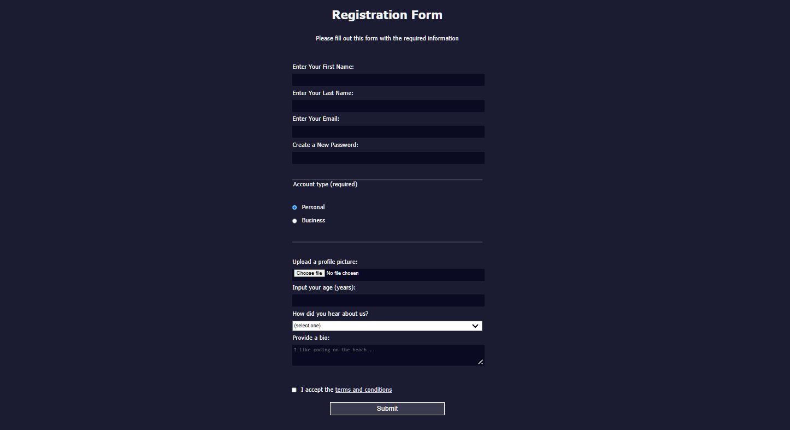

# Registration-Form
[[View Live Page](https://rituparna-pahal.github.io/Registration-Form/)] 
#### Welcome to my Registration Form project! This project is a simple and clean registration form created using HTML and CSS, designed to help me reinforce and strengthen my web development skills.
- This is a intermediate registration form created as part of the **[FreeCodeCamp]** curriculum.
- The form allows users to enter their personal details and submit them for processing.
## Preview

## Features

- User-friendly form layout
- Input fields for name, email, password, etc.
- Basic client-side validation
- Responsive design for various screen sizes
- ## Technologies Used

- HTML5
- CSS3
